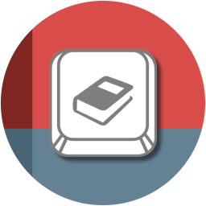

#####

    
    <h2 align="center">Welcome to <code>Au3InputLogbook</code>【ツ】</h2>

[Description](#description) | [Features](#features) | [Getting started](#getting-started) | [Configuration](#configuration) | [Keyboard shortcuts](#keyboard-shortcuts) | [Contributing](#contributing) | [License](#license) | [Acknowledgements](#acknowledgements)

## Description

Au3InputLogbook is a tool to capture your keyboard inputs and write that log information to a markdown file. So you have a logbook of your input activities and you can analyze that later on.

## Features

To be defined [...]

## Getting started

#### *Preconditions*

To be defined [...]

#### *Installation*

To be defined [...]

## Configuration

To be defined [...]

## Keyboard Shortcuts

| Action | Shortcut |
| :---   | :---     |
| ...    | ...      |
| ...    | ...      |

## Contributing

Just look at [CONTRIBUTING](https://github.com/Sven-Seyfert/Au3InputLogbook/blob/main/docs/CONTRIBUTING.md), thank you!

## License

Distributed under the MIT License. See [LICENSE](https://github.com/Sven-Seyfert/Au3InputLogbook/blob/main/LICENSE.md) for more information.

## Acknowledgements

- Opportunity by [GitHub](https://github.com)
- Badges by [Shields](https://shields.io)
- Utilities components by
  - Me (GetCurrentPressedKeyCode.au3)

##

[To the top](#)
